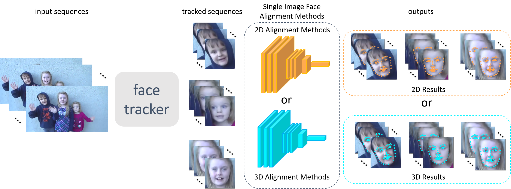
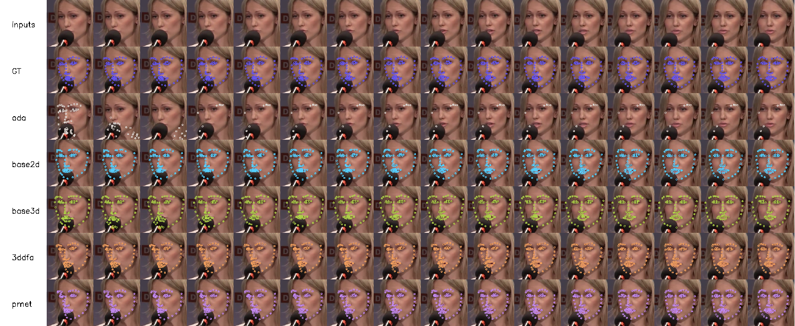

# VideoFaceAlignment

A simple pipline for video-based face alignment, including both 2D and 3D methods. We ensemble 4 state-of-the-art single-image-based face alignment methods to implement video-based face alignment by aligning face frame-by-frame, we also provide a simple post process method called "trajectory-smooth" to get better alignment results. 4 SOTA single-image-based methods are follows:

**FAN**: [https://github.com/1adrianb/face-alignment](https://github.com/1adrianb/face-alignment)

**AdaptiveWL**:[https://github.com/protossw512/AdaptiveWingLoss](https://github.com/protossw512/AdaptiveWingLoss)

**3DDFA**:[https://github.com/cleardusk/3DDFA](https://github.com/cleardusk/3DDFA)

**PRNet**:[https://github.com/YadiraF/PRNet](https://github.com/YadiraF/PRNet)





###dependencies

- Python 3.6

- Pytorch >= 1.0

- VideoFace3D (for face tracking,  3ddfa and some basic utils):[https://github.com/lstcutong/video-face-3d](https://github.com/lstcutong/video-face-3d)

- download models from BaiduYun [data.zip](https://pan.baidu.com/s/1sqHDJP-doFoDH4-kvirrkQ) password:acn0 , and extracts to "./data"


### quick usage

```python
from VideoFA import VideoFA

vfa = VideoFA(detector, use_smooth, smooth_mode)
# for detector, we provide in ./VideoFA.py:
#    MODEL_FAN2D : FAN-2D method
#    MODEL_FAN3D : FAN-3D method
#    MODEL_ADAPT : AdaptiveWingLoss method
#    MODEL_3DDFA : 3DDFA method
#    MODEL_PRNET : PRNet method
# for use_smooth
#    True : use "trajectory smooth"
#    False : not use "trajectory smooth"
# for smooth_mode, we provide in ./utils/time_smooth.py 
#    SMOOTH_METHODS_MEDUIM : meduim filter
#    SMOOTH_METHODS_MEAN : mean filter
#    SMOOTH_METHODS_GAUSSIAN : gaussian filter

results = vfa.start_align_video(seq_path)
# seq_path is where detected faces sequences are saved, make sure the sequences' names are in frame order and each frame's size be 224*224 
# results is a [seq_len, 68, 2] ndarray
```


### some results



base-2d and base-3d stands for FAN-2D and FAN-3D, ada stands for AdaptiveWL

### To Do

- Fix AaptiveWL's results incorrect problem
- Provide video preprocess pipline (currently needs users handly preprocess a single video)

